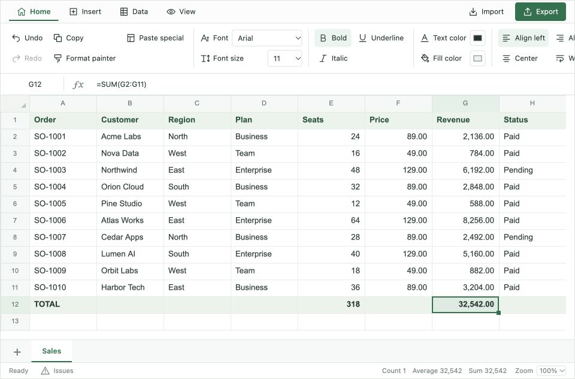
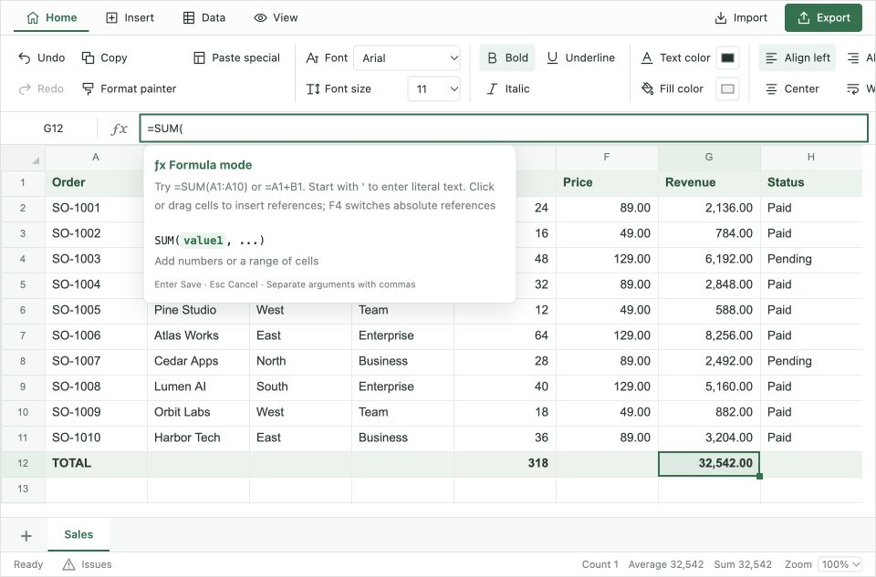

# OnlineExcel

An embeddable spreadsheet for browser applications, written in TypeScript. OnlineExcel implements its own workbook model, formula engine, Canvas grid, and XLSX mapping. The core runtime depends only on `fflate` for ZIP and `saxes` for XML.

**English** · [简体中文](https://github.com/SamuelSupe/onlineexcel/blob/main/README.zh-CN.md)

[Releases](https://github.com/SamuelSupe/onlineexcel/releases) · [npm](https://www.npmjs.com/package/onlineexcel) · [Examples](#react-and-vue) · [Documentation](#documentation)



*The standalone JavaScript example running in Chrome, populated with sample sales data. All processing stays in the browser.*

> This is a 0.1-series spreadsheet library for everyday office workflows. See the [compatibility matrix](docs/compatibility.md) for supported features and limitations. GitHub Release **v0.1.2** includes the October 3, 2026 performance and consistency fixes. Install its archive below to use this version; the npm registry remains at 0.1.1.

## Features

- Multiple worksheets, range editing, cell styles, merging, frozen panes, sorting, filtering, find and replace, clipboard operations, and drag fill.
- Atomic transactions, bounded history of changes, undo/redo, incremental recalculation, named ranges, relative/absolute references, and references across worksheets.
- **187 formula functions**, including conditional aggregates, lookup, text, date, finance, and dynamic arrays. Inspect signatures and limitations with `listFunctions()`.
- XLSX, CSV, and versioned JSON import/export. Unknown formulas retain their original text; compatibility diagnostics identify unsupported content, and lossy exports require explicit opt-in.
- Canvas rendering, Worker-owned workbook state, viewport caching, multiple independent instances, and Shadow DOM style isolation.
- English, Simplified Chinese, Traditional Chinese, Japanese, and Korean interfaces, configured per editor.
- Optional autosave and draft recovery, an issue panel with cell navigation, 50–200% zoom, format painter, and keyboard help.
- Promise-based APIs, change events, cancellation, Worker factories, custom functions, host validation, chunked/record access, and optional React/Vue adapters.

Desktop browsers and keyboard/mouse workflows are the primary target. Charts, pivot tables, VBA, collaborative editing, legacy `.xls`, and encrypted files are outside the first-release editing scope. Preservation of existing embedded objects has separate limits documented in the compatibility matrix.

## Install

Download `onlineexcel-0.1.2.tgz` from [GitHub Release v0.1.2](https://github.com/SamuelSupe/onlineexcel/releases/tag/v0.1.2), then run:

```sh
npm install ./onlineexcel-0.1.2.tgz
npx onlineexcel-copy-assets public/onlineexcel
```

The package includes ESM, a browser script, a separate Worker, TypeScript declarations, and optional React/Vue entry points. Configure `workerUrl: "/onlineexcel/worker.js"` after copying the assets.

Each release includes `SHA256SUMS` for its downloadable archives. `npm install onlineexcel` currently installs the older npm release, 0.1.1. When upgrading, deploy the main library, Worker, and shared chunks from the same release together; v0.1.2 uses Worker protocol 2.

## Embed in an application

Give the container an explicit height, such as `height: 600px`. Editor styles are included in the library.

```ts
import { createWorkbook, mountEditor } from "onlineexcel";

const workbook = await createWorkbook({
  workerUrl: "/onlineexcel/worker.js",
  sheets: [{ name: "Sales", rows: 100_000, columns: 100 }],
});
const editor = mountEditor(document.querySelector("#spreadsheet")!, {
  workbook,
  locale: "en-US",
});
await editor.ready;

const [sheet] = (await workbook.getMetadata()).sheets;
await workbook.setValues(sheet.id, "A1:B2", [
  ["Quantity", "Unit price"],
  [12, 39.9],
]);
await workbook.setFormula(sheet.id, "C2", "=A2*B2");
console.log(await workbook.getValues(sheet.id, "C2")); // [[478.8]]

const unsubscribe = workbook.on("change", (event) => {
  console.log(event.revision, event.changes);
});
await editor.commitEdit();
const { data, diagnostics } = await workbook.exportXlsx();
// data is a Uint8Array. The host chooses where to download or persist it.

// When the host no longer needs the editor and workbook:
unsubscribe();
await editor.destroy({ commit: true });
await workbook.dispose();
```

`mountEditor` does not own the workbook. Destroying the view leaves the workbook API usable; call `dispose()` when the workbook itself is no longer needed.

Autosave is opt-in: create a controller with `createPersistence(workbook, { key, storage })` and pass it to the editor as `persistence`. Library instances do not access storage by default.

### Formula editing

Typing `=` in a cell or the formula bar opens a friendly formula-mode hint, function suggestions, and argument help.



Use **↑ / ↓** to select a suggestion and **Tab** to complete it. **Enter** saves; **Esc** cancels. Click or drag across cells to insert a reference, switch sheets for cross-sheet references, and press **F4** to cycle relative, absolute, and mixed references. Start with an apostrophe, such as `'=text`, to enter literal text beginning with `=`. Hints follow the editor language and hide during IME composition.

Sorting supports headers, range expansion, and multiple keys. Filters support conditions and selectable values. Copying and selection statistics respect filtered rows; paste options include values, formulas and values, formats, and transpose. CSV import provides an encoding and column-type preview. Sheet duplication, hiding, name management, dropdown validation, basic conditional formatting, and locked ranges are also available.

### Choose a language

All language packs are bundled. Set `locale` when mounting an editor:

```js
import { createWorkbook, mountEditor, supportedLocales } from "onlineexcel";

const workbook = await createWorkbook();
const editor = mountEditor(document.querySelector("#sheet"), {
  workbook,
  locale: "en-US",
});
await editor.ready;
```

| Language | `locale` |
| --- | --- |
| English | `en-US` |
| Simplified Chinese — library default | `zh-CN` |
| Traditional Chinese — Taiwan | `zh-TW` |
| Japanese | `ja-JP` |
| Korean | `ko-KR` |

`supportedLocales` lists the available languages; TypeScript consumers can import the `Locale` type. Each editor has its own locale. Unsupported JavaScript values fall back to `zh-CN`.

Localization covers toolbars, dialogs, status text, accessibility labels, formula hints, and common operation errors. It does not translate worksheet names, cell contents, number formats, formula function names, or argument names. Developer API errors and file compatibility diagnostics retain their original wording.

The local demo accepts `?locale=en-US` to select the editor language; its sample workbook and surrounding demo text remain in Chinese. The [standalone example](examples/vanilla/index.html) uses English by default.

### Without a build tool

Serve the entire `dist/` directory from the same origin as your application:

```html
<div id="sheet" style="height:600px"></div>
<script src="/onlineexcel/onlineexcel.js"></script>
<script type="module" src="/my-spreadsheet-page.js"></script>
```

```js
// my-spreadsheet-page.js
const workbook = await OnlineExcel.createWorkbook();
const editor = OnlineExcel.mountEditor(document.querySelector("#sheet"), {
  workbook,
  locale: "en-US",
});
await editor.ready;
```

The default Worker URL is relative to the library script. Pass `workerUrl` explicitly if your assets use another location. A classic script needs an `async` function around the same initialization code.

### React and Vue

- [React example](examples/react/main.tsx): create and dispose the editor through effect lifecycle hooks, including StrictMode handling.
- [Vue example](examples/vue/main.ts): initialize in `onMounted` and release resources in `onBeforeUnmount`.
- [Vanilla JavaScript example](examples/vanilla/main.js): load the browser script directly.
- [Installed-package example](examples/installed/README.md): production builds using the installed package, strict CSP, and integration checks for all three hosts.

The repository's React/Vue examples use source imports. Applications should import `onlineexcel/react` or `onlineexcel/vue` and configure the Worker asset URL. Neither framework is required by the core package.

## Run locally

```sh
git clone https://github.com/SamuelSupe/onlineexcel.git
cd onlineexcel
npm ci
npm run dev
```

Open `http://127.0.0.1:5173/?locale=en-US`. The demo includes sales data, cross-sheet summaries, dynamic arrays, and a million-cell benchmark generator. Committed edits are saved to local IndexedDB; reopening lets you restore the draft or keep the current workbook. The large-sheet benchmark suspends autosave and preserves the previous draft.

```sh
npm run check       # Type checking, behavior tests, and library builds
npm run functions   # Regenerate formula capability documentation
npm run bench       # Fixed-dataset core and XLSX benchmarks
npm pack            # Build an installable package archive
```

To open the standalone English example, run `npm run build`, start `npm run dev`, and visit `http://127.0.0.1:5173/examples/vanilla/index.html`. The README screenshots show this example after entering sample sales data through the editor.

Linux validation uses OrbStack; browser validation uses local Chrome. See the [validation record](docs/validation.md) for measured results, environment limitations, and checks that remain unverified. Running the library requires no application server, database, or cloud service.

## Deployment and CSP

Deploy all assets to a same-origin directory accessible to the host. The Worker imports shared build chunks, so copying only `worker.js` is insufficient.

The formula interpreter does not use `eval` or `new Function`. For a strict CSP, use directives such as `script-src 'self'; worker-src 'self'; style-src 'nonce-YOUR_NONCE'` and pass `mountEditor(container, { workbook, styleNonce: 'YOUR_NONCE' })`. Generate a fresh nonce in the host and use the same value in its CSP. Cross-origin isolation and `SharedArrayBuffer` are not required. Development servers may need additional CSP configuration.

Customize the editor through CSS variables: `--oe-accent`, `--oe-accent-soft`, `--oe-border`, `--oe-text`, `--oe-muted`, and `--oe-font`.

Read-only mode and sheet protection prevent accidental editor changes; the host still controls access and may call write APIs. Unlock input ranges before enabling sheet protection.

## Documentation

The detailed reference documents are currently in Chinese; code examples and API identifiers are in English.

- [API reference](docs/api.md): workbook, range, transaction, event, and file contracts.
- [SDK integration guide](docs/sdk.md): lifecycle, Worker setup, adapters, extensions, and persistence.
- [Compatibility matrix](docs/compatibility.md): file fidelity, editing scope, and resource limits.
- [Formula catalog](docs/functions.md): function signatures and supported parameters.
- [Validation record](docs/validation.md): functional checks and scoped performance results.

Advanced integrations and tests can use the synchronous model exported from `onlineexcel/core`. Normal browser applications should use the Worker-driven top-level API.

## License

[MIT](LICENSE). ZIP/XML dependencies retain their own licenses through the npm dependency tree.
